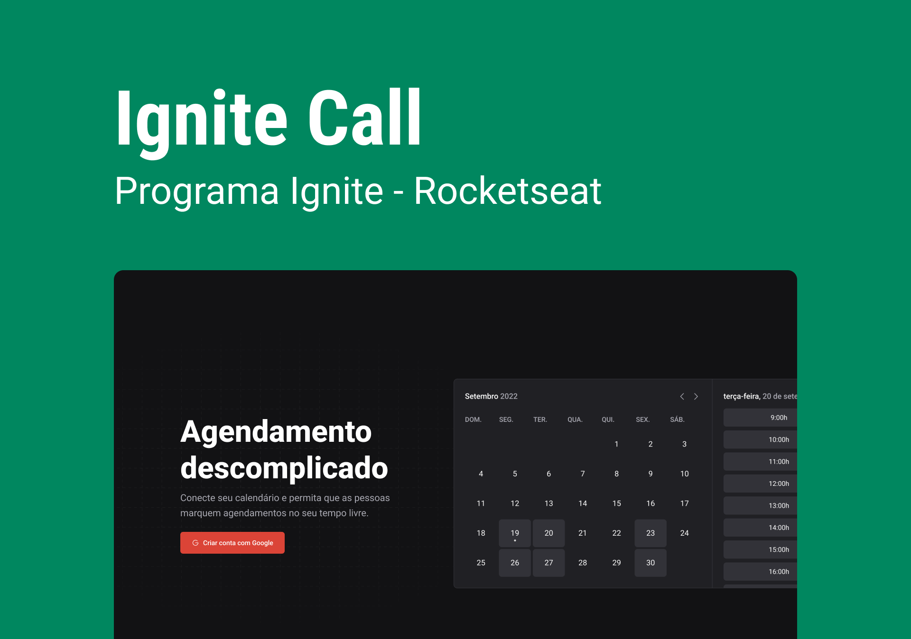

# Ignite Call

Aplicação para Agendamento de Chamadas desenvolvida com Next.js e Prisma

## [Link do deploy](https://ignitecall.vercel.app/)

## 📑 Sobre

Essa aplicação permite ao usuário configurar uma agenda de disponibilidade e compartilhar com clientes em potencial para que façam o agendamento em horário comum.

Por ser integrada a Calendar API do Google, o evento é criado automaticamente na agenda de ambas as partes.

## 🛠 Tecnologias utilizadas
- Typescript
- @ignite-ui/react
- @tayhsn-ui/react
- React Query
- Axios
- Dayjs
- Next auth
- Next seo
- Nookies
- Zod
- React-hook-form
- Googleapis
- Prisma